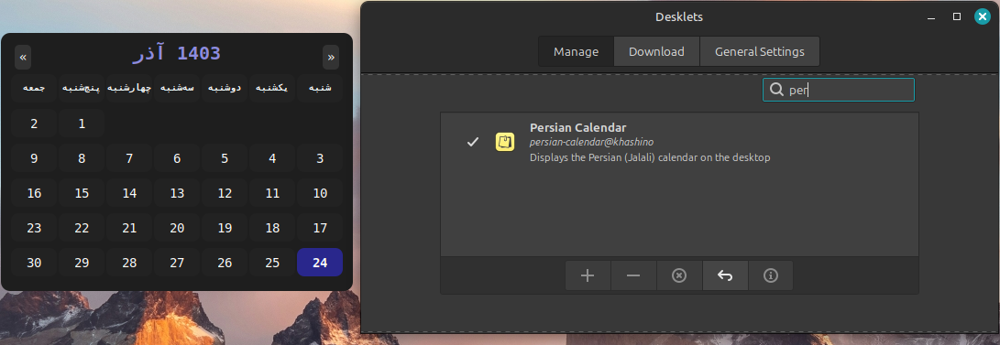

# Persian Calendar Desklet

A Cinnamon desklet for Linux Mint that displays a Persian (Jalali) calendar with current date highlighting, month navigation, and RTL support.

تقویم فارسی برای لینوکس مینت 

## Features

- Displays the current Persian calendar month.
- Highlights today's date if the current month is displayed.
- Provides navigation arrows to switch between months.
- Fully RTL (Right-To-Left) support.
- Customizable via `stylesheet.css`.

## Screenshot




## Installation

### From GitHub

1. Clone the repository:
```bash
git clone https://github.com/khashino/persian-calendar.git
```
2. Create the desklet directory:

```bash
mkdir -p ~/.local/share/cinnamon/desklets/persian-calendar@khashino
```
3. Copy all the files from the cloned repository into the newly created directory:

```bash
cp -r persian-calendar/* ~/.local/share/cinnamon/desklets/persian-calendar@khashino
```
4. Reload Cinnamon:
```
Press Alt + F2, type r, and press Enter to reload the desktop environment.
```
5. Open the Desklets menu:

Right-click on your desktop, select "Add Desklets".
Find "Persian Calendar" in the list and add it to your desktop.

### Manual Download (ZIP)
If you don’t want to use git:

Download the ZIP file from the GitHub releases page or directly from the repository page (Code > Download ZIP).

Extract the ZIP file.

Create the desklet directory (if it doesn't exist):

```bash
mkdir -p ~/.local/share/cinnamon/desklets/persian-calendar@khashino
```
Copy all extracted files into the persian-calendar@khashino directory:

```bash
cp -r persian-calendar-master/* ~/.local/share/cinnamon/desklets/persian-calendar@khashino
```
Reload Cinnamon (Alt + F2 > r > Enter).

Add the desklet from the Cinnamon Desklets menu as described above.

Customization
Modify stylesheet.css to change colors, fonts, sizes, and other visual elements.
The code resides in desklet.js, where you can make changes to logic and layout.

